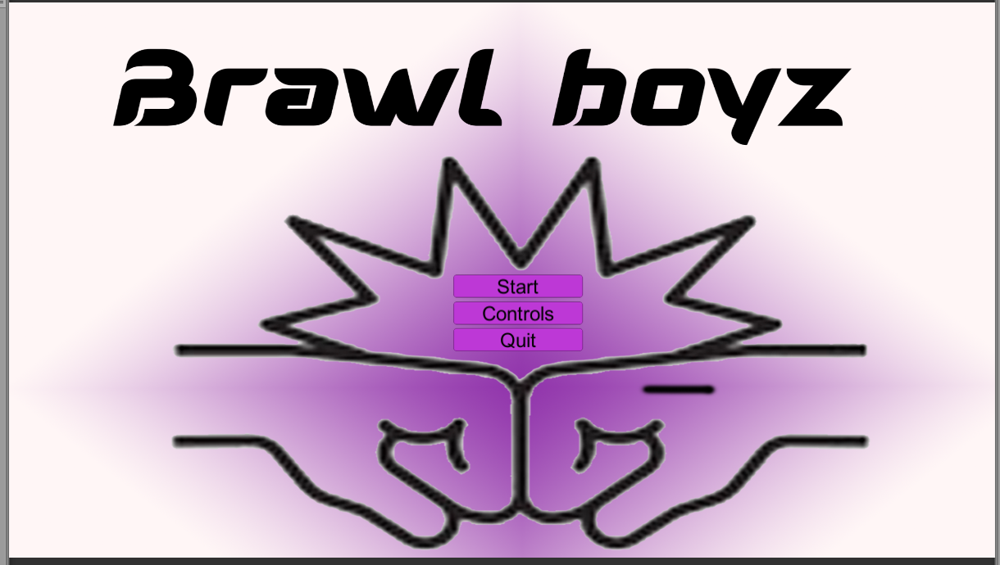
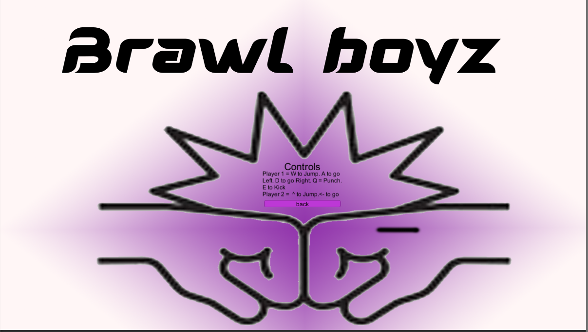
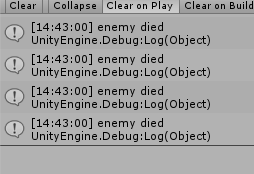

# gallery

  
  
 Here is a snapshot of people playing my game 

  
  
 This is the home screen of my game i made this home page 

  
 

  
  
 This is the the controls for my game it only shows the controls for player one becasue i couldnt make the textg box any larger its all squashed

          

  
  
when player two dies this pop  up shows but only for player two. player one cant take any damage

          
