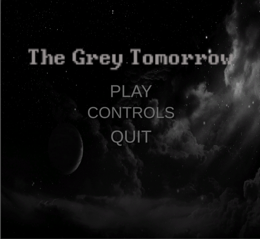
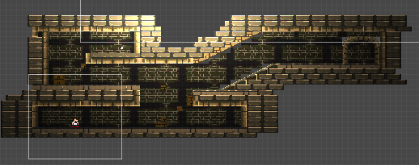

# gallery

  
  
 this is the main menu for my game 

  
  
 This is the level layout of level 1 

  
 

  
  
 This is the the controls for my game it only shows the controls for player one becasue i couldnt make the textg box any larger its all squashed

          

  
  
when player two dies this pop  up shows but only for player two. player one cant take any damage

          
